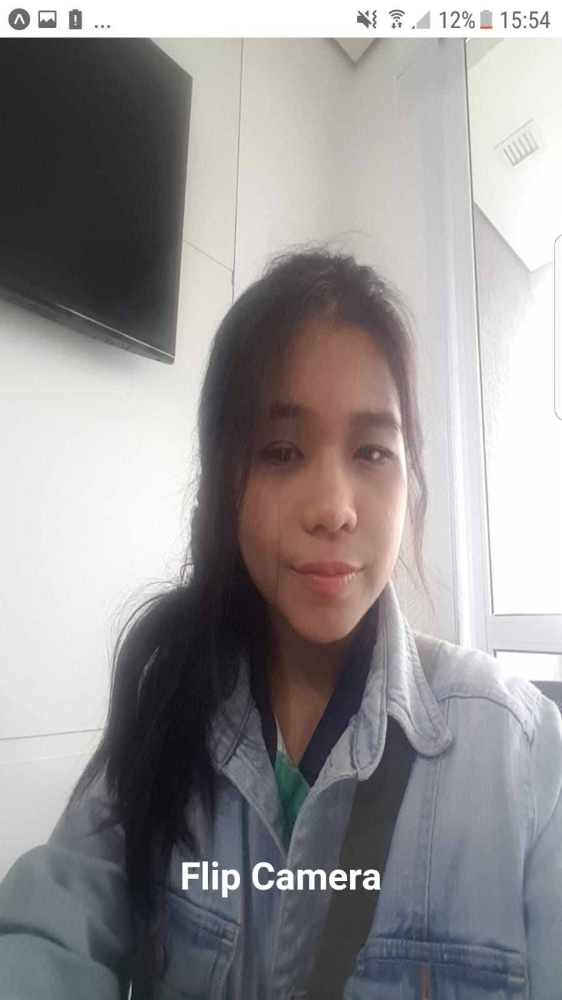

<h1 align="center"> Expo - Flip Camera  </h1>

    Permission to access and change cell phone camera.

  <a href="#-technologies">Technologies</a>&nbsp;&nbsp;&nbsp;|&nbsp;&nbsp;&nbsp;
  <a href="#-project">Project</a>&nbsp;&nbsp;&nbsp;|&nbsp;&nbsp;&nbsp;
  <a href="#-references">References</a>&nbsp;&nbsp;&nbsp;|&nbsp;&nbsp;&nbsp;
  <a href="#memo-licence">Licence</a>

  

 

## Screen

    
    
    

## 🚀 Technologies

This project was developed with the following technologies:

- [Expo](https://expo.dev/)
- [React Native](https://reactnative.dev/)

## 💻 Project

Project to access the cell phone camera and ask for authorization.

START
- npm i
- npm start or expo start

Links Usefull:

 Node Download - https://nodejs.org/en/download/

 VSCode Download -  https://code.visualstudio.com/download

## 🔖 References

Expo Camera: https://docs.expo.dev/versions/latest/sdk/camera/

## :memo: Licence

This project is under the MIT license.

---

Made with ♥ by Karoline :wave: [Let's program together!](https://www.linkedin.com/in/karoline-hikari-yamamoto/)
